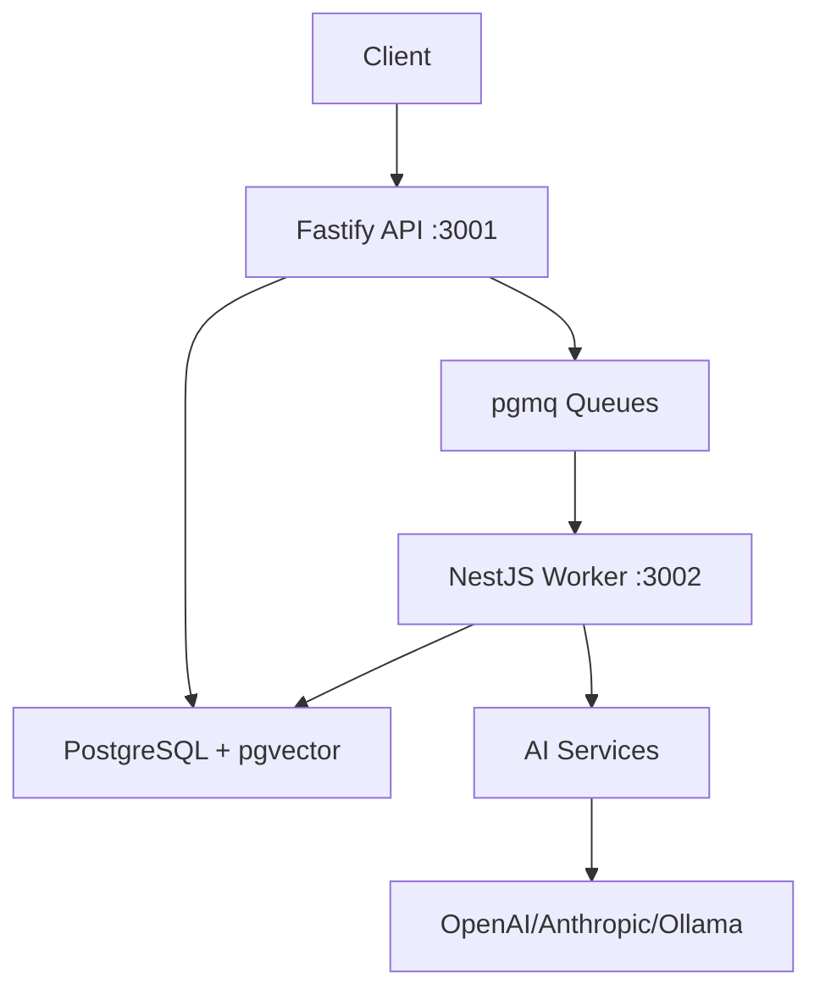

# 🐬 Cosmic Dolphin

A full-stack TypeScript application built with modern microservices architecture, featuring a Fastify REST API and NestJS background worker with AI integration capabilities.

## 🏗️ Architecture Overview

Cosmic Dolphin is structured as a monorepo with a clean separation between API, worker services, and shared utilities:

```
cosmic-dolphin/
├── packages/
│   ├── api/              # Fastify REST API Server (Port 3001)
│   ├── worker/           # NestJS Background Worker (Port 3002)
│   └── shared/           # Shared TypeScript types and utilities
├── .do/                  # DigitalOcean App Platform configs
├── supabase/migrations/  # Database migrations (PostgreSQL + pgmq)
└── docker-compose.yml    # Local development environment
```

### Service Architecture



## 🛠️ Tech Stack

### Core Technologies
- **Runtime**: Bun (primary), Node.js 22+ (compatible)
- **Language**: TypeScript 5.x
- **Package Manager**: Bun workspaces

### API Service (`packages/api/`)
- **Framework**: Fastify 4.x
- **Authentication**: JWT with `@fastify/jwt`
- **Database**: PostgreSQL with Supabase client
- **Security**: Helmet, CORS
- **Validation**: Zod schemas
- **Testing**: Jest with Bun test runner

### Worker Service (`packages/worker/`)
- **Framework**: NestJS 10.x
- **Queue System**: pgmq (PostgreSQL Message Queue)
- **AI Integration**: Multiple providers (OpenAI, Anthropic, Ollama)
- **Configuration**: NestJS Config module
- **Testing**: Jest with NestJS testing utilities

### Infrastructure
- **Database**: PostgreSQL 15+ with pgvector extension
- **Queue System**: pgmq (PostgreSQL-based message queues)
- **Deployment**: Docker containers on DigitalOcean App Platform
- **CI/CD**: GitHub Actions with automated deployments

## 🚀 Quick Start

### Prerequisites

```bash
# Required
node >= 22.0.0
bun >= 1.0.0

# For local development
docker
docker-compose
```

### Local Development Setup

1. **Clone and install dependencies**:
   ```bash
   git clone <repository-url>
   cd cosmic-dolphin
   bun install
   ```

2. **Environment configuration**:
   ```bash
   cp .env.example .env
   # Edit .env with your configuration (see ENV_CONFIG.md)
   ```

3. **Start development environment**:
   ```bash
   # Option 1: Full Docker environment (recommended)
   bun run docker:up

   # Option 2: Manual development
   docker-compose up postgres -d  # Start PostgreSQL
   bun run dev                    # Start API and Worker
   ```

### Available Scripts

```bash
# Development
bun run dev              # Start both API and Worker in development mode
bun run docker:up        # Start all services with Docker Compose
bun run docker:down      # Stop Docker services
bun run docker:logs      # View Docker logs

# Building
bun run build            # Build all packages (shared → api → worker)
bun run clean            # Clean build artifacts

# Testing & Quality
bun run test             # Run tests for all packages
bun run lint             # Lint all packages

# Individual package commands
bun run --cwd packages/api dev       # API development server
bun run --cwd packages/worker start:dev  # Worker development server
```

## 📡 API Reference

### Health & Status Endpoints

| Endpoint | Method | Description |
|----------|--------|-------------|
| `/health` | GET | API health check |
| `/api/v1/status` | GET | Detailed API status |

### Worker Health Check

| Endpoint | Method | Description |
|----------|--------|-------------|
| `http://localhost:3002/health` | GET | Worker service health |

## 🗄️ Database Schema

The application uses PostgreSQL with pgvector extension and pgmq for queuing:

- **Schema**: Defined in `supabase/migrations/` directory
- **ORM**: Supabase client with direct SQL
- **Migrations**: Supabase migration system
- **Extensions**: pgvector (AI embeddings), pgmq (message queues)

### Local Database Setup

```bash
# Using Docker Compose (recommended)
docker-compose up postgres -d

# Manual PostgreSQL setup with Supabase
npx supabase start
npx supabase db reset
```

## 🔄 Background Jobs & Queue System

The system uses **pgmq** (PostgreSQL Message Queue) instead of Redis for reliable message processing:

### Queue Architecture
- **Technology**: pgmq extension for PostgreSQL
- **Queues**: `default`, `tasks`, `notifications`, `bookmarks`
- **Benefits**: ACID transactions, no additional infrastructure, PostgreSQL-native

### Queue Operations

```typescript
// Example queue operations
interface QueueMessage {
  msg_id: number;
  read_ct: number;
  enqueued_at: Date;
  vt: Date;
  message: any;
}

// Queue service methods
await queueService.sendMessage('bookmarks', payload);
const message = await queueService.popMessage('bookmarks');
await queueService.archiveMessage('bookmarks', messageId);
```

### Adding New Job Types

1. Define job type in `packages/shared/src/types.ts`
2. Add processor in `packages/worker/src/queue/handlers/`
3. Register handler in `packages/worker/src/queue/queue.module.ts`

## 🤖 AI Integration

The worker service integrates with multiple AI providers through the shared AI service:

- **OpenAI**: GPT models via `@ai-sdk/openai`
- **Anthropic**: Claude models via `@ai-sdk/anthropic`
- **Ollama**: Local models via `ollama-ai-provider-v2`
- **Azure OpenAI**: Enterprise models via `@ai-sdk/azure`

### Configuration

```env
# AI Provider API Keys
OPENAI_API_KEY=your_openai_key
ANTHROPIC_API_KEY=your_anthropic_key
AZURE_OPENAI_API_KEY=your_azure_key
AZURE_OPENAI_ENDPOINT=your_azure_endpoint

# Ollama (local)
OLLAMA_BASE_URL=http://localhost:11434
```

## 🚢 Deployment

### DigitalOcean App Platform

The project includes automated CI/CD via GitHub Actions:

1. **Triggers**: Push to `main` branch or manual dispatch
2. **Process**:
   - Run Supabase migrations (including pgmq setup)
   - Build and test all packages
   - Build Docker images
   - Push to DigitalOcean Container Registry
   - Deploy API and Worker as separate apps

### Required Environment Variables

```env
# Production essentials
NODE_ENV=production
DATABASE_URL=your_supabase_connection_string
JWT_SECRET=your_secure_jwt_secret

# Service Ports
API_PORT=3001
WORKER_PORT=3002

# AI Services (optional)
OPENAI_API_KEY=your_openai_key
ANTHROPIC_API_KEY=your_anthropic_key
```

### Manual Docker Deployment

```bash
# Build images
docker build -f packages/api/Dockerfile -t cosmic-dolphin-api .
docker build -f packages/worker/Dockerfile -t cosmic-dolphin-worker .

# Run with Docker Compose
docker-compose up -d
```

## 🧪 Testing Strategy

### Test Structure
```
packages/
├── api/
│   ├── src/
│   │   └── **/*.spec.ts      # Unit tests
│   └── jest.config.ts
├── worker/
│   ├── src/
│   │   └── **/*.spec.ts      # Unit tests
│   └── test/
│       └── **/*.e2e-spec.ts  # E2E tests
└── shared/
    └── src/
        └── **/*.test.ts       # Utility tests
```

### Running Tests
```bash
# All packages
bun run test

# Individual packages
bun run --cwd packages/api test
bun run --cwd packages/worker test
bun run --cwd packages/shared test

# Watch mode
bun run --cwd packages/api test --watch
```

## 🔧 Development Workflow

### Adding New Features

1. **Shared Types**: Add to `packages/shared/src/types.ts`
2. **API Endpoints**: Add to `packages/api/src/routes/`
3. **Background Jobs**: Add to `packages/worker/src/queue/handlers/`
4. **Build Shared**: `bun run --cwd packages/shared build`

### Queue Development

```typescript
// 1. Define message type in shared/src/types.ts
export interface MyTaskPayload extends QueueTaskPayload {
  type: "my_task";
  data: {
    // task-specific data
  };
}

// 2. Create handler in worker/src/queue/handlers/
@Injectable()
export class MyTaskHandler implements MessageHandler {
  canHandle(message: any): boolean {
    return message.type === "my_task";
  }

  async handle(message: QueueMessage): Promise<void> {
    // Process the task
  }
}

// 3. Register in queue.module.ts
```

### Code Quality

```bash
# Linting
bun run lint

# Type checking
bun run --cwd packages/api tsc --noEmit
bun run --cwd packages/worker tsc --noEmit
```

## 📚 Documentation

- **Environment Setup**: [`ENV_CONFIG.md`](./ENV_CONFIG.md)
- **API Documentation**: Auto-generated from Fastify schemas
- **Architecture Details**: [`packages/README.md`](./packages/README.md)

## 🤝 Contributing

1. **Fork** the repository
2. **Create** a feature branch: `git checkout -b feature/amazing-feature`
3. **Commit** changes: `git commit -m 'Add amazing feature'`
4. **Test** thoroughly: `bun run test && bun run lint`
5. **Push** to branch: `git push origin feature/amazing-feature`
6. **Create** a Pull Request

### Development Guidelines

- Follow existing TypeScript and architectural patterns
- Add tests for new features
- Update documentation for API changes
- Ensure all packages build successfully
- Use conventional commit messages

## 📊 Monitoring & Observability

### Health Checks
- **API**: `GET /health` - Basic health status
- **Worker**: `GET :3002/health` - Worker service status
- **Database**: Connection validation in health checks
- **Queue**: pgmq queue status via PostgreSQL queries

### Logging
- **API**: Fastify built-in logging with Pino
- **Worker**: NestJS logging with custom formatters
- **Development**: Pretty-printed logs via `pino-pretty`

### Queue Monitoring

```sql
-- Monitor queue status
SELECT * FROM pgmq.metrics('bookmarks');

-- View pending messages
SELECT * FROM pgmq_public.q_bookmarks;

-- Archive old messages
SELECT pgmq.purge_queue('bookmarks', '2024-01-01'::timestamp);
```

## 🔐 Security

- **Authentication**: JWT-based with secure secret management
- **CORS**: Configured via `@fastify/cors`
- **Helmet**: Security headers via `@fastify/helmet`
- **Environment**: Secrets managed via environment variables
- **Database**: Parameterized queries, RLS policies via Supabase

## 📋 Troubleshooting

### Common Issues

1. **Port Conflicts**: Ensure ports 3001, 3002 are available
2. **Docker Issues**: Run `docker-compose down && docker-compose up -d`
3. **Build Failures**: Clean and rebuild: `bun run clean && bun run build`
4. **Database Connection**: Verify `DATABASE_URL` in `.env`
5. **Queue Issues**: Check pgmq extension: `SELECT * FROM pg_extension WHERE extname = 'pgmq';`

### Debug Mode

```bash
# API debug
bun run --cwd packages/api dev

# Worker debug
bun run --cwd packages/worker start:debug

# Queue debugging
SELECT pgmq.metrics_all();  -- View all queue metrics
```

---

**License**: ISC
**Version**: 1.0.0
**Maintained by**: Cosmic Dolphin Team